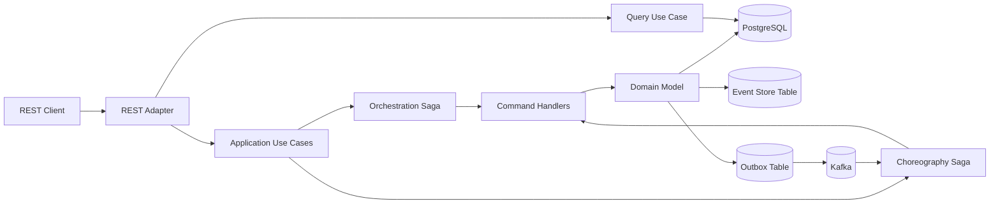

# PoC Saga Orquestación y Coreografía sin Axon

PoC en **Java 25** y **Spring Boot** para comparar dos formas de implementar Saga en un caso de **payment processing** sin usar Axon Framework ni Axon Server.

Incluye:

- Saga por **orquestación**.
- Saga por **coreografía**.
- Commands, events, queries y compensaciones.
- DDD + arquitectura hexagonal.
- PostgreSQL como base transaccional, event store simple y outbox.
- Kafka como broker de eventos para coreografía.
- Infraestructura Docker.
- Requests/responses de prueba.
- Datasets y scripts de apoyo.

## Caso de uso

El flujo procesa pagos con estos pasos:

1. Crear pago.
2. Reservar fondos.
3. Validar fraude.
4. Capturar settlement.
5. Completar pago.

Si fraude rechaza el pago, se ejecutan compensaciones:

1. Liberar fondos.
2. Cancelar pago.
3. Marcar Saga como compensada.

La regla de fraude de la PoC es simple:

```text
amount > 5000 = fraude rechazado
amount <= 5000 = fraude aprobado
```

## Arquitectura



## Diferencia entre los dos flujos

### Orquestación

La clase `PaymentOrchestrationSaga` controla el proceso completo.

```text
CreatePayment
  -> ReserveFunds
  -> ValidateFraud
  -> CaptureSettlement
  -> CompletePayment
```

Si algo falla:

```text
ReleaseFunds
  -> CancelPayment
  -> Saga COMPENSATED
```

### Coreografía

La clase `PaymentChoreographySaga` reacciona a eventos publicados en Kafka.

```text
PaymentCreatedEvent
  -> FundsReservedEvent
  -> FraudApprovedEvent
  -> SettlementCapturedEvent
  -> PaymentCompletedEvent
```

Si ocurre fraude:

```text
FraudRejectedEvent
  -> ReleaseFundsCommand
  -> CancelPaymentCommand
```

## Estructura del proyecto

```text
spring-saga-dual-patterns-poc/
├── pom.xml
├── README.md
├── src/main/java/com/example/payments
│   ├── domain
│   │   ├── model
│   │   ├── commands
│   │   ├── events
│   │   └── queries
│   ├── application
│   │   ├── ports/in
│   │   ├── ports/out
│   │   ├── usecase
│   │   └── saga
│   │       ├── orchestration
│   │       └── choreography
│   └── infrastructure
│       ├── adapters/in/rest
│       ├── adapters/out/persistence
│       ├── adapters/out/messaging
│       └── config
└── infraestructura
    ├── docker
    │   └── docker-compose.yml
    ├── request-response
    └── datasets
```

## Componentes principales

| Componente | Descripción |
|---|---|
| `PaymentApplicationService` | Ejecuta comandos del dominio: crear pago, reservar fondos, validar fraude, capturar, completar y compensar. |
| `PaymentOrchestrationSaga` | Orquestador central que decide el siguiente comando. |
| `PaymentChoreographySaga` | Manejador de eventos para coreografía. |
| `KafkaEventPublisherAdapter` | Publica eventos usando Outbox + Kafka. |
| `ChoreographyEventConsumer` | Consume eventos de Kafka y dispara pasos de la Saga coreografiada. |
| `EventStoreAdapter` | Guarda eventos de dominio en tabla `event_store`. |
| `PaymentPersistenceAdapter` | Adaptador JPA para pagos. |
| `SagaPersistenceAdapter` | Adaptador JPA para estado de Saga. |

## Levantar infraestructura

```bash
cd infraestructura/docker
docker compose up -d
```

Servicios:

| Servicio | Puerto |
|---|---:|
| PostgreSQL | 5432 |
| Kafka | 9092 |
| Kafka UI | 8085 |

## Ejecutar aplicación

Desde la raíz:

```bash
mvn clean spring-boot:run
```

La aplicación levanta en:

```text
http://localhost:8080
```

## Probar flujo de orquestación

### Caso exitoso

```bash
curl -X POST http://localhost:8080/payments/v1/orchestrated-payments \
  -H "Content-Type: application/json" \
  -d '{"amount": 120.50, "currency": "USD"}'
```

### Caso con compensación

```bash
curl -X POST http://localhost:8080/payments/v1/orchestrated-payments \
  -H "Content-Type: application/json" \
  -d '{"amount": 6000.00, "currency": "USD"}'
```

## Probar flujo de coreografía

### Caso exitoso

```bash
curl -X POST http://localhost:8080/payments/v1/choreographed-payments \
  -H "Content-Type: application/json" \
  -d '{"amount": 250.00, "currency": "USD"}'
```

### Caso con compensación

```bash
curl -X POST http://localhost:8080/payments/v1/choreographed-payments \
  -H "Content-Type: application/json" \
  -d '{"amount": 9000.00, "currency": "USD"}'
```

## Consultar pago

```bash
curl http://localhost:8080/payments/v1/payments/{paymentId}
```

## Consultar Saga

```bash
curl http://localhost:8080/payments/v1/payments/{paymentId}/saga
```

## Request/response

Los ejemplos están en:

```text
infraestructura/request-response
```

Incluye:

- `orchestration-success.http`
- `orchestration-compensation.http`
- `choreography-success.http`
- `choreography-compensation.http`
- `query-payment.http`
- `query-saga.http`

## Datasets

La carpeta solicitada está en:

```text
infraestructura/datasets
```

Incluye instrucciones en:

```text
infraestructura/datasets/README.md
```

## Nota de diseño

Esta PoC tiene un solo microservicio modular para facilitar la ejecución local. En una arquitectura real podrías separar:

```text
payment-service
funds-service
fraud-service
settlement-service
payment-orchestrator-service
```

La diferencia clave es que aquí el proyecto muestra ambos patrones sin introducir frameworks de Saga externos.
