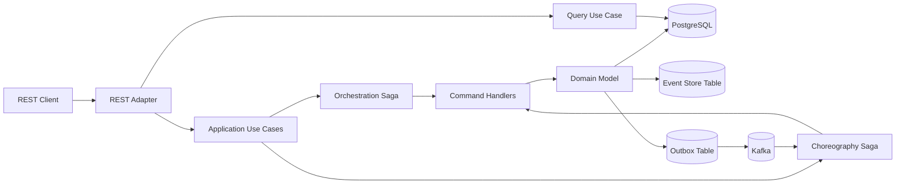

# PoC Saga Orquestación y Coreografía

PoC en **Java 25** y **Spring Boot** para comparar dos formas de implementar Saga en un caso de **payment processing**.

Incluye:

- Saga por **orquestación**.
- Saga por **coreografía**.
- Commands, events, queries y compensaciones.
- DDD + arquitectura hexagonal.
- PostgreSQL como base transaccional, event store simple y outbox.
- Kafka como broker de eventos para coreografía.
- Infraestructura Docker.
- Requests/responses de prueba.
- Datasets y scripts de apoyo.

## Caso de uso

El flujo procesa pagos con estos pasos:

1. Crear pago.
2. Reservar fondos.
3. Validar fraude.
4. Capturar settlement.
5. Completar pago.

Si fraude rechaza el pago, se ejecutan compensaciones:

1. Liberar fondos.
2. Cancelar pago.
3. Marcar Saga como compensada.

La regla de fraude de la PoC es simple:

```text
amount > 5000 = fraude rechazado
amount <= 5000 = fraude aprobado
```

## Arquitectura



## Diferencia entre los dos flujos

### Orquestación

La clase `PaymentOrchestrationSaga` controla el proceso completo.

```text
CreatePayment
  -> ReserveFunds
  -> ValidateFraud
  -> CaptureSettlement
  -> CompletePayment
```

Si algo falla:

```text
ReleaseFunds
  -> CancelPayment
  -> Saga COMPENSATED
```

### Coreografía

La clase `PaymentChoreographySaga` reacciona a eventos publicados en Kafka.

```text
PaymentCreatedEvent
  -> FundsReservedEvent
  -> FraudApprovedEvent
  -> SettlementCapturedEvent
  -> PaymentCompletedEvent
```

Si ocurre fraude:

```text
FraudRejectedEvent
  -> ReleaseFundsCommand
  -> CancelPaymentCommand
```

## Estructura del proyecto

```text
spring-saga-dual-patterns-poc/
├── pom.xml
├── README.md
├── src/main/java/com/example/payments
│   ├── domain
│   │   ├── model
│   │   ├── commands
│   │   ├── events
│   │   └── queries
│   ├── application
│   │   ├── ports/in
│   │   ├── ports/out
│   │   ├── usecase
│   │   └── saga
│   │       ├── orchestration
│   │       └── choreography
│   └── infrastructure
│       ├── adapters/in/rest
│       ├── adapters/out/persistence
│       ├── adapters/out/messaging
│       └── config
└── infraestructura
    ├── docker
    │   └── docker-compose.yml
    ├── request-response
    └── datasets
```

## Componentes principales

| Componente | Descripción |
|---|---|
| `PaymentApplicationService` | Ejecuta comandos del dominio: crear pago, reservar fondos, validar fraude, capturar, completar y compensar. |
| `PaymentOrchestrationSaga` | Orquestador central que decide el siguiente comando. |
| `PaymentChoreographySaga` | Manejador de eventos para coreografía. |
| `KafkaEventPublisherAdapter` | Publica eventos usando Outbox + Kafka. |
| `ChoreographyEventConsumer` | Consume eventos de Kafka y dispara pasos de la Saga coreografiada. |
| `EventStoreAdapter` | Guarda eventos de dominio en tabla `event_store`. |
| `PaymentPersistenceAdapter` | Adaptador JPA para pagos. |
| `SagaPersistenceAdapter` | Adaptador JPA para estado de Saga. |

## Levantar infraestructura

```bash
cd infraestructura/docker
docker compose up -d
```

Servicios:

| Servicio | Puerto |
|---|---:|
| PostgreSQL | 5432 |
| Kafka | 9092 |
| Kafka UI | 8085 |

## Ejecutar aplicación

Desde la raíz:

```bash
mvn clean spring-boot:run
```

Al iniciar, **Flyway ejecuta automáticamente** las migraciones de `src/main/resources/db/migration` antes de que Hibernate valide el esquema. La migración `V1__init.sql` crea `payments`, `saga_instances`, `event_store` y `outbox_events`.

La integración con Kafka usa `spring-boot-starter-kafka`, requerido por la modularización de Spring Boot 4 para cargar `KafkaAutoConfiguration`, crear `KafkaTemplate` y configurar los `@KafkaListener` a partir de `spring.kafka.*`.

Si vienes de una ejecución anterior que dejó un volumen de PostgreSQL inconsistente, reinicia únicamente el entorno local de la PoC una vez:

```bash
cd infraestructura/docker
docker compose down -v
docker compose up -d
cd ../..
mvn spring-boot:run
```

> `docker compose down -v` elimina los datos locales del PostgreSQL de esta PoC. No lo uses si agregaste datos que necesites conservar.

La aplicación levanta en:

```text
http://localhost:8080
```

## Probar flujo de orquestación

### Caso exitoso

```bash
curl -X POST http://localhost:8080/payments/v1/orchestrated-payments \
  -H "Content-Type: application/json" \
  -d '{"amount": 120.50, "currency": "USD"}'
```

### Caso con compensación

```bash
curl -X POST http://localhost:8080/payments/v1/orchestrated-payments \
  -H "Content-Type: application/json" \
  -d '{"amount": 6000.00, "currency": "USD"}'
```

## Probar flujo de coreografía

### Caso exitoso

```bash
curl -X POST http://localhost:8080/payments/v1/choreographed-payments \
  -H "Content-Type: application/json" \
  -d '{"amount": 250.00, "currency": "USD"}'
```

### Caso con compensación

```bash
curl -X POST http://localhost:8080/payments/v1/choreographed-payments \
  -H "Content-Type: application/json" \
  -d '{"amount": 9000.00, "currency": "USD"}'
```

## Consultar pago

```bash
curl http://localhost:8080/payments/v1/payments/{paymentId}
```

## Consultar Saga

```bash
curl http://localhost:8080/payments/v1/payments/{paymentId}/saga
```

## Request/response

Los ejemplos están en:

```text
infraestructura/request-response
```

Incluye:

- `orchestration-success.http`
- `orchestration-compensation.http`
- `choreography-success.http`
- `choreography-compensation.http`
- `query-payment.http`
- `query-saga.http`

## Datasets

La carpeta solicitada está en:

```text
infraestructura/datasets
```

Incluye instrucciones en:

```text
infraestructura/datasets/README.md
```

## Nota de diseño

Esta PoC tiene un solo microservicio modular para facilitar la ejecución local. En una arquitectura real podrías separar:

```text
payment-service
funds-service
fraud-service
settlement-service
payment-orchestrator-service
```


## Validación del proyecto

Antes de levantar la aplicación, valida el build y las pruebas unitarias. También se valida que la auto-configuración de Flyway de Spring Boot 4 esté presente y que `V1__init.sql` contenga las cuatro tablas JPA:

```bash
mvn clean test
```

Luego levanta la infraestructura y ejecuta la aplicación:

```bash
cd infraestructura/docker
docker compose up -d
cd ../..
mvn spring-boot:run
```

> Importante: extrae este ZIP en una carpeta nueva. No lo descomprimas encima de una versión anterior del proyecto, porque podrían quedar fuentes obsoletos (por ejemplo, configuraciones antiguas de Jackson) que Maven también intentará compilar.

## Kafka event envelope and DLT

Kafka messages on `payment.events` use an explicit envelope:

```json
{
  "eventType": "PaymentCreatedEvent",
  "payload": "{...domain event json...}"
}
```

The outbox stores the event type and domain payload separately and builds this envelope only when publishing to Kafka. The row is marked `published=true` only after Kafka acknowledges the send.

Malformed messages or messages produced by older versions that do not contain `eventType`/`payload` are moved to `payment.events.DLT` and acknowledged, preventing a poison record from blocking `payment.events` indefinitely.

For a completely clean local functional test after upgrading from v4, reset the PoC infrastructure:

```bash
cd infraestructura/docker
docker compose down -v
docker compose up -d
cd ../..
mvn clean test
mvn spring-boot:run
```

## Transacciones locales en la Saga de orquestación

La orquestación no se ejecuta dentro de una única transacción ACID. El método
`startOrchestratedPayment` usa `Propagation.NOT_SUPPORTED` y cada comando de
`PaymentApplicationService` mantiene su propia transacción local.

Cuando fraude rechaza un pago de orquestación, `validateFraud` persiste
`FRAUD_REJECTED` y su evento, y luego lanza `FraudRejectedException` con
`noRollbackFor`. El orquestador recibe esa señal y ejecuta las compensaciones
`releaseFunds` y `cancel` en transacciones independientes. El resultado esperado
para un monto superior a `app.fraud.reject-above` es HTTP 201 con el pago en
`CANCELLED` y la saga en `COMPENSATED`; no debe aparecer
`Transaction silently rolled back because it has been marked as rollback-only`.
